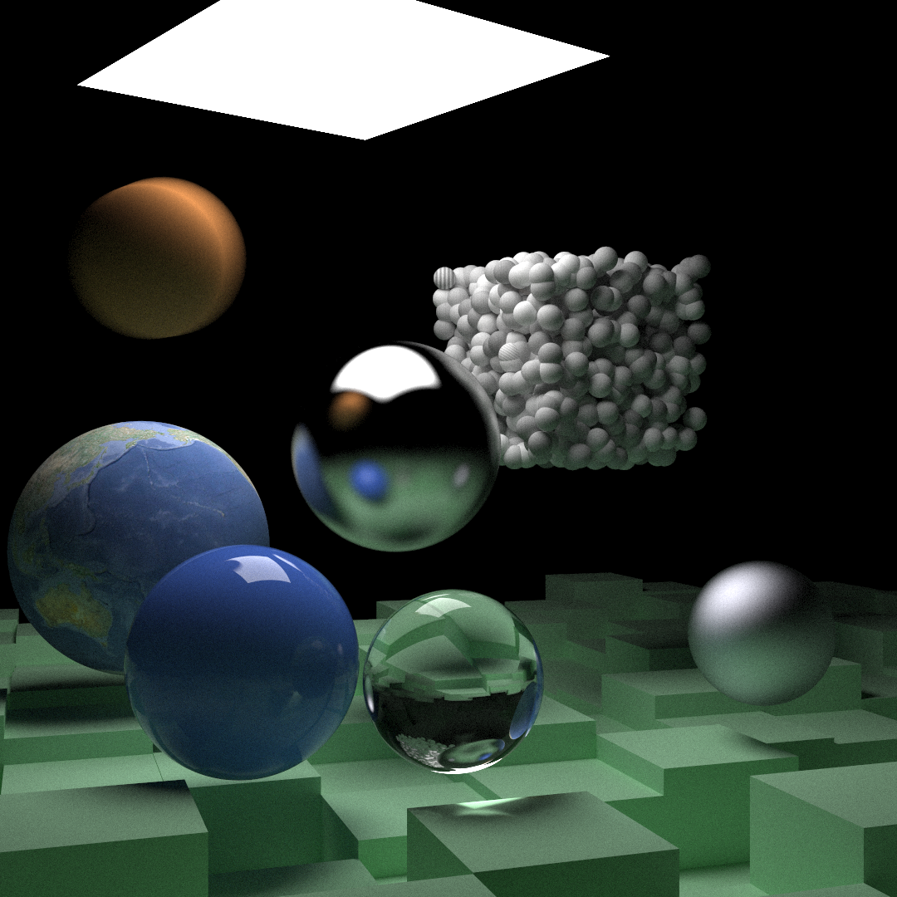

A GPU accelerated path tracer implementation in CUDA, based on the [Ray Tracing in One Weekend](https://raytracing.github.io/) series.

## Running the project
### Requirements
- [Nix](https://nixos.org/) - All dependencies are managed through the Nix development environment.

### Clone the repository
```
$ git clone git@github.com:yotzol/rays.git
$ cd rays
```

### Set up development environment
```
$ nix develop
```

### Set CUDA architecture flag
Edit the `CMakeLists.txt` file with the appropriate architecture flag for your GPU:
```
set(CMAKE_CUDA_ARCHITECTURES 75)  # Change this to match your GPU architecture
```

### Build
```
$ mkdir build
$ cd build
$ cmake -G Ninja ..
$ ninja
```

### Run
From the build directory:
```
$ ./rays
```
