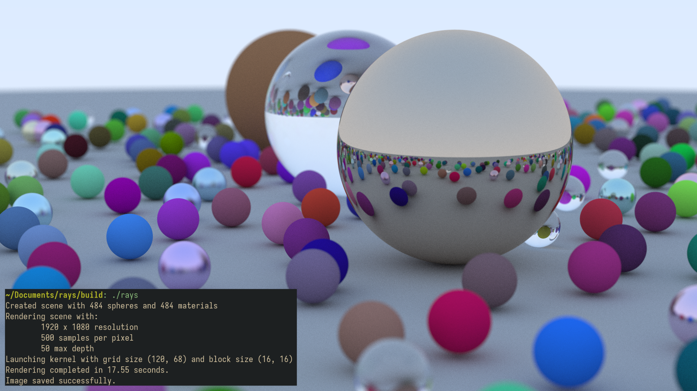

A GPU accelerated ray tracer implementation in CUDA, based on the [Ray Tracing in One Weekend](https://raytracing.github.io/) series.

## Requirements
- [Nix](https://nixos.org/) - All dependencies are managed through the Nix development environment.
- [direnv](https://direnv.net/) (optional) - Automatically loads and unloads environment variables when entering/leaving the project directory.

### Install Nix
```
$ sh <(curl -L https://nixos.org/nix/install) --daemon
```

### Install Direnv
```
$ curl -sfL https://direnv.net/install.sh | bash
```

## Setup
### 1. Clone the repository
```
$ git clone git@github.com:yotzol/rays.git
$ cd rays
```

### 2. Set up development environment
With direnv:
```
$ direnv allow
```
Without direnv: 
```
$ nix develop
```

### 3. Set CUDA architecture flag
Edit the `CMakeLists.txt` file and set the appropriate architecture flag for your GPU:
```
set(CMAKE_CUDA_ARCHITECTURES 75)  # Change this to match your GPU architecture
```

## Building
```
$ mkdir build
$ cd build
$ cmake -G Ninja ..
$ ninja
```

## Run
From the build directory:
```
$ ./rays
Created scene with 484 spheres and 484 materials
Rendering scene with:
        1920 x 1080 resolution
        500 samples per pixel
        50 max depth
Launching kernel with grid size (120, 68) and block size (16, 16)
Rendering completed in 17.55 seconds.
Image saved successfully.
```
The resulting render will be saved to `build/output.png`.
